<picture>
  <source media="(prefers-color-scheme: dark)" srcset="./assets/card-dark.svg" />
  <source media="(prefers-color-scheme: light)" srcset="./assets/card-light.svg" />
  
</picture>

  

<a href="https://github.com/Foufou-exe?tab=achievements">
<picture>
  <source media="(prefers-color-scheme: dark)" srcset="./assets/trophies-dark.svg" />
  <source media="(prefers-color-scheme: light)" srcset="./assets/trophies-light.svg" />
  
</picture>
</a>

  

<a href="https://github.com/Foufou-exe/Foufou-exe/actions/workflows/profile.yml">
<picture>
  <source media="(prefers-color-scheme: dark)" srcset="./assets/contrib-dark.svg" />
  <source media="(prefers-color-scheme: light)" srcset="./assets/contrib-light.svg" />
  
</picture>
</a>

  

  

&nbsp;
&nbsp;

