<picture>
  <source media="(prefers-color-scheme: dark)" srcset="./assets/card-dark.svg" />
  <source media="(prefers-color-scheme: light)" srcset="./assets/card-light.svg" />
  
</picture>

  

  

&nbsp;
&nbsp;

 

<code>card regenerated daily by <a href="./scripts/generate_card.py">generate_card.py</a></code>

